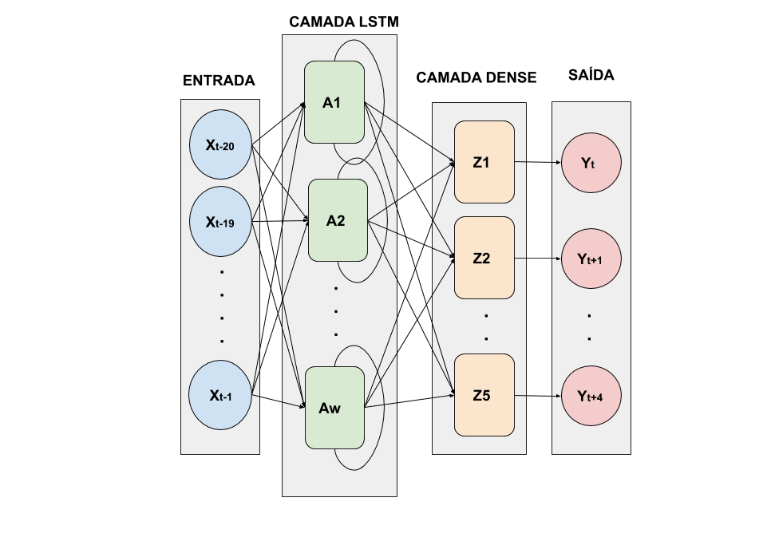

# Power-Forecasting
## Abstract
Stochastic nature of some meteorological factors, such as the local solar radiance, ambient temperature, wind speed, directly influences photovoltaic energy generation. Due to this, estimate the produced energy amount is fundamentally important to production quality, in what to avoid problems on electrical network. Therefore, this article presents an analysis of prediction methods for generation data (power) on photovoltaic panels from meteorological data usage. The data were collected from an low-cost solarimetric station close to the production plant. Obtained information include: solar radiance, panels temperature, ambient temperature, humidity, wind speed, rain amount, voltage and Current used to feed an Long Short-Term Memory (LSTM) neural network, whose function is the prediction of power produced by the solar panels data. Results show that the LSTW Network presents good estimation values, having an average error lower than 0.20\%, both for power.

## Getting Started

Clone the project in your computer and open project with Spyder

### Prerequisites

For build in linux desktop is necessary:

* [Python 3.6](https://www.python.org/downloads/release/python-360/)
* [Tensorflow](https://www.tensorflow.org/install)
* [Keras](https://keras.io/)
* [Sklearn](https://scikit-learn.org/stable/)
* [Numpy](https://numpy.org/)
* [Pandas](https://pandas.pydata.org/)

## Long Short-Term Memory(LSTM)

lstm built in this work

  

